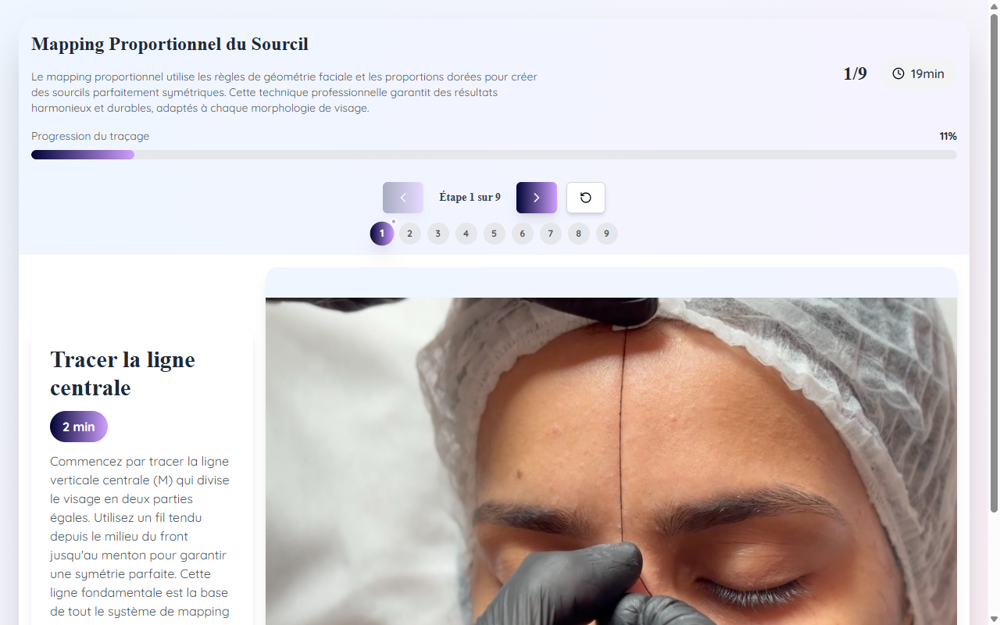

# Technique Visuelle — Microblading / Microblading EN / Microblading+Microshading

**Course:** MICROBLADING / MICROBLADING (EN) / MICROBLADING + MICROSHADING  
**Slide:** 9 / 10  
**Live URL:** https://cv.edtechiecorp.com  
**Stack:** Next.js · Tailwind CSS · TypeScript · GitHub Pages  

## What this slide does

An interactive visual guide presenting the core microblading technique through step-by-step diagrams and annotated illustrations. Shared across three courses (French microblading, English microblading, and the combined microblading+microshading course), this slide shows practitioners the correct hand position, stroke direction, and pigment deposit method for creating natural-looking brow hair strokes.

## Screenshot

## Usage

This slide is embedded as an iframe inside Coassemble at the live URL above. DNS is managed via Cloudflare (`edtechiecorp.com`). To update the slide, push to the `main` branch — GitHub Actions will rebuild and redeploy automatically.
